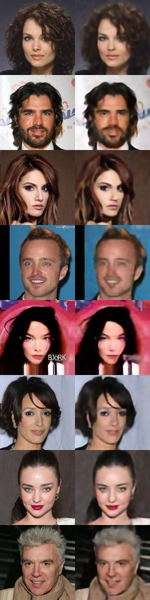
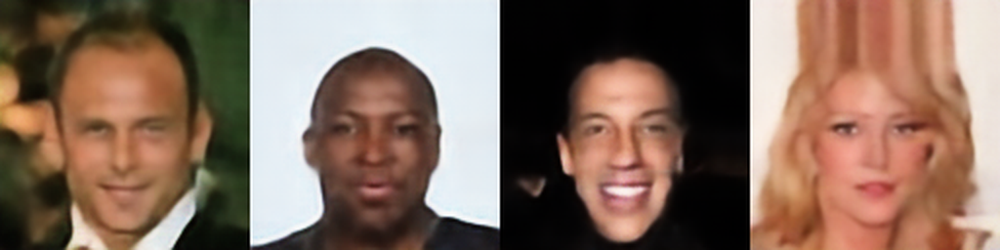
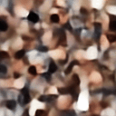
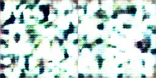
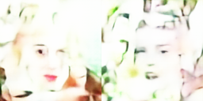
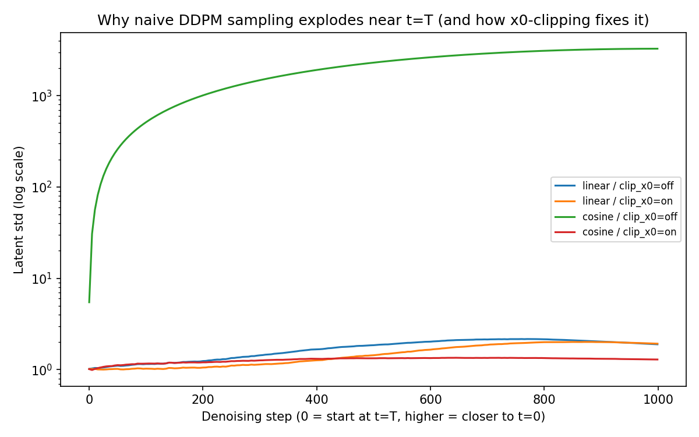

# Latent Diffusion Playground — From Noise to Latent Diffusion

[](https://codespaces.new/yoonjae26/DDPM-U-Net-From-Noise-to-Latent-Diffusion)

An educational, from-scratch implementation of the full pipeline behind models like Stable
Diffusion: **VAE → Latent Diffusion (DDPM/DDIM) → U-Net**, trained on CelebA faces. Every
component — the VAE encoder/decoder, the noise schedulers, the U-Net, the samplers — is
implemented and trained from scratch (not loaded from a pretrained hub), so the code itself is
the teaching material.

```
Image → VAE Encoder → Latent → (+ noise, forward process) → U-Net → (− noise, reverse process) → Latent → VAE Decoder → Image
```

## Try it now — no local setup required

Click the badge above (or **Code → Create codespace on main**) to open a full browser-based dev
environment. It automatically installs dependencies, downloads the pretrained checkpoints, and
launches the interactive web demo — a preview window opens on its own once it's ready
(normally 1–2 minutes). No `git clone`, no local Python environment.

## Showcase

| VAE reconstruction (MSE + KL + LPIPS) | Faces generated from pure noise (DDPM) |
|---|---|
|  |  |

**Reverse diffusion**: 1000 steps of iterative denoising, from random noise to a decoded face.



**Why naive DDPM sampling explodes to pure noise — and how clipping fixes it** (see
[Key findings](#key-findings) below):

| Cosine schedule, no x0-clipping | Cosine schedule, with x0-clipping |
|---|---|
|  |  |
|  (log scale — cosine without clipping diverges within ~50 steps) | |

## What you can do here

- **VAE Explorer** — encode an image, watch the reparameterization trick (`z = μ + σ·ε`) in
  action, decode it back, and see the reconstruction error.
- **Forward diffusion** — watch a latent get progressively noisier at any timestep `t`, compare
  linear vs. cosine schedules.
- **Reverse diffusion (generation)** — start from pure Gaussian noise and watch the U-Net
  denoise it step by step into a face, with DDPM (stable) or DDIM (faster, experimental) sampling.
- **Scheduler Stability Lab** — a live reproduction of a real numerical-instability bug this
  project hit and fixed (see below), with the actual before/after plots.

## Quickstart (local)

```bash
git clone https://github.com/yoonjae26/DDPM-U-Net-From-Noise-to-Latent-Diffusion.git
cd DDPM-U-Net-From-Noise-to-Latent-Diffusion

uv sync --extra gui --extra train
uv run python scripts/download_checkpoints.py   # fetches the pretrained VAE + U-Net (~440MB)
uv run streamlit run scripts/web_demo.py
```

No `uv`? `pip install -e ".[gui,train]"` works the same way (drop `uv run` from the commands
above).

## Training your own models

The full pipeline, phase by phase (see [docs/PHASE_PLAN.md](docs/PHASE_PLAN.md) for the complete
phase breakdown and status):

```bash
# Phase 1 — build the CelebA manifest + normalization stats
uv run python scripts/phase1_dataset_pipeline.py --data-root ./Data --image-size 128

# Phase 2 — train the VAE (spatial 4x16x16 latent, ~2-3h on a single modern GPU)
uv run python scripts/phase2_train_vae.py \
  --epochs 50 --batch-size 512 --num-workers 16 \
  --latent-channels 4 --kl-weight 1e-3 --amp --amp-dtype bf16

# Optional: sharpen reconstructions with an LPIPS perceptual loss (resume from the run above)
uv run python scripts/phase2_train_vae.py \
  --resume-checkpoint artifacts/phase2/checkpoint_last.pt \
  --epochs 80 --batch-size 512 --num-workers 16 \
  --perceptual-weight 0.1 --amp --amp-dtype bf16 \
  --output-dir artifacts/phase2_lpips

# Phase 6 — train the latent diffusion U-Net on top of the VAE
uv run python scripts/phase6_train_latent_diffusion.py \
  --vae-checkpoint artifacts/phase2_lpips/vae_last.pt \
  --epochs 400 --batch-size 512 --num-workers 16 \
  --base-channels 192 --scheduler cosine --timesteps 1000 \
  --amp --amp-dtype bf16

# Phase 7 — generate images from pure noise
uv run python scripts/phase7_reverse_diffusion.py \
  --unet-checkpoint artifacts/phase6/unet_last.pt \
  --vae-checkpoint artifacts/phase2_lpips/vae_last.pt \
  --latent-scaling artifacts/phase6/latent_scaling.json \
  --sampler ddpm --num-samples 4
```

Tune `--batch-size`/`--num-workers` to your hardware — with `--num-workers 0` (an easy default to
miss) the GPU sits mostly idle waiting on single-threaded data loading.

## Key findings

Two real engineering problems came up while building this, both documented in full (root cause,
experiments, fix) in [docs/PHASE_PLAN.md](docs/PHASE_PLAN.md):

1. **A well-trained model that only generates noise.** Even with low validation loss on both the
   VAE and the U-Net, sampling from pure noise always decoded to static. Root cause: the cosine
   noise schedule's `beta` approaches its `0.999` clamp near `t=T`, producing a
   `1/sqrt(alpha_t) ≈ 31.6` amplification on the very first denoising step. With no bound on the
   predicted `x0`, this turns any small model error into a runaway trajectory — latent magnitude
   grows from ~1 to ~3000 within 1000 steps. **Fix**: clip the predicted `x0` at every step
   ("dynamic thresholding" — standard in every production DDPM/LDM, missing here). Reproduced and
   visualized in `scripts/phase11_scheduler_stability_lab.py` (see the Showcase section above).

2. **Adding a GAN loss for sharper images — implemented correctly, still didn't help.** A
   PatchGAN discriminator with VQGAN-style adaptive loss weighting was added to `vae_trainer.py`
   to sharpen the VAE decoder's output (the standard recipe used by Stable Diffusion's
   autoencoder). Three tuning attempts all failed the same way: the discriminator wins almost
   immediately, and the adaptive weighting (correctly) shrinks the GAN term to near-zero to
   protect training stability — leaving no sharpening effect. Root cause: the technique assumes a
   generator still actively learning reconstruction, but this VAE was fine-tuned from an
   already-converged checkpoint, where the reconstruction gradient is too small to compare
   against. The code remains in the repo (`--adversarial-weight`, opt-in, default off) as a
   documented, correctly-implemented starting point for anyone who wants to pick this up.

## Project structure

```
scripts/                      Runnable phase scripts (phase1 ... phase11) + web_demo.py
src/latent_diffusion_playground/
  models/                      VAE, latent U-Net, PatchGAN discriminator
  diffusion/                   Noise schedulers, forward (q_sample) and reverse (p_sample/ddim) processes
  training/                    VAE trainer (MSE + KL + optional LPIPS/adversarial loss)
  data/                        CelebA preprocessing and PyTorch dataset
  phases/                      Shared loading/viewer utilities used by multiple scripts
docs/PHASE_PLAN.md             Full phase-by-phase plan, status, and engineering write-ups
contributions/                 Community additions (see below)
```

## Contributions

- [`contributions/yuseungjun/stable-diffusion-vae`](contributions/yuseungjun/stable-diffusion-vae) —
  a companion demo using a *pretrained* Stable Diffusion VAE (from Hugging Face) to show the same
  image ↔ latent bridge with production-scale weights, for comparison against this repo's
  from-scratch VAE.

## Dataset

[CelebA (CelebFaces Attributes Dataset)](https://mmlab.ie.cuhk.edu.hk/projects/CelebA.html), used
for research/educational purposes.
